# inner-echo

[](https://github.com/sebastianspicker/inner-echo/actions/workflows/ci.yml)

Privacy-first, client-only guided media lab for metaphor-based experience framing.

## At a Glance (Public-Facing)

`inner-echo` is an interactive web app that helps make difficult internal experiences more discussable through careful audiovisual metaphors.

For the public product position, audience, boundaries, and accessibility commitment, see [PRODUCT.md](PRODUCT.md). The visual direction for public-alpha work is in [DESIGN.md](DESIGN.md).

It is built to be:
- respectful and non-diagnostic,
- safety-oriented,
- transparent about evidence and limitations.

## Technical Scope (Engineer-Facing)

`inner-echo` is a browser-only runtime composed of:
- React UI (`src/ui`)
- local runtime engine (`src/engine`)
- profile-driven condition system (`src/conditions`)
- WebGL/Canvas video processing + optional WebAudio graph
- deterministic test and screenshot pipelines (Playwright + Vitest)

No backend is required for core runtime behavior.

For code orientation, start with:
- [`src/app/App.tsx`](src/app/App.tsx) — mounts the application shell.
- [`src/ui/CameraView.tsx`](src/ui/CameraView.tsx) — coordinates UI state, camera/audio permissions, and runtime controllers.
- [`src/ui/hooks/useProfileLoad.ts`](src/ui/hooks/useProfileLoad.ts) — loads preset profiles or composer output.
- [`src/ui/hooks/useReactivePipeline.ts`](src/ui/hooks/useReactivePipeline.ts) — starts the video overlay loop and AV coupling layer.
- [`src/conditions/graphBuilder.ts`](src/conditions/graphBuilder.ts) — translates profile JSON into executable video nodes.
- [`src/engine/audio/audioEngine.ts`](src/engine/audio/audioEngine.ts) and [`src/engine/canvas/webglPipeline.ts`](src/engine/canvas/webglPipeline.ts) — own WebAudio and WebGL runtime resources.

## What This Repository Is

- A local-first prototype for exploring perceptual metaphors.
- A reproducible engineering artifact with quality gates and contract verification.
- A safety-first interface with explicit controls (`Safe Mode`, `Reduced Motion`, `Stop Everything`).
- A transparent documentation set with in-repo evidence references.

## What This Repository Is Not

`inner-echo` is not:
- a diagnostic tool,
- a medical device,
- a treatment platform,
- a claim of clinical simulation accuracy.

It does not attempt to infer mental health diagnoses from user data.
It does not send webcam or microphone streams to remote services in the current scope.

## Safety & Privacy

- Camera/microphone access is strictly user-gesture gated.
- Microphone is optional and can be disabled any time.
- Media processing stays in the browser; application assets are bundled and served from the same origin.
- The runtime has no analytics, third-party services, or media transmission. A deployed copy still needs its static files to be delivered unless the host adds an offline cache.
- Debug/evidence tooling supports transparent review.

Canonical references:
- Reliability: [`docs/RELIABILITY.md`](docs/RELIABILITY.md)
- Security & privacy: [`docs/SECURITY.md`](docs/SECURITY.md)
- Evidence corpus: [`docs/references/README.md`](docs/references/README.md)

## Quick Start

Prerequisite: Node.js 22, matching CI.

```bash
npm ci
npm run dev
```

Open `http://127.0.0.1:5173` (or the Vite host shown in your terminal).

Useful local checks:

```bash
npm run typecheck
npm run lint
npm test
npm run verify
```

Browser E2E checks use Playwright with a deterministic synthetic camera stream:

```bash
npm run browsers:install # once per machine
npm run test:e2e
npm run test:e2e:preview
```

## Architecture Flow

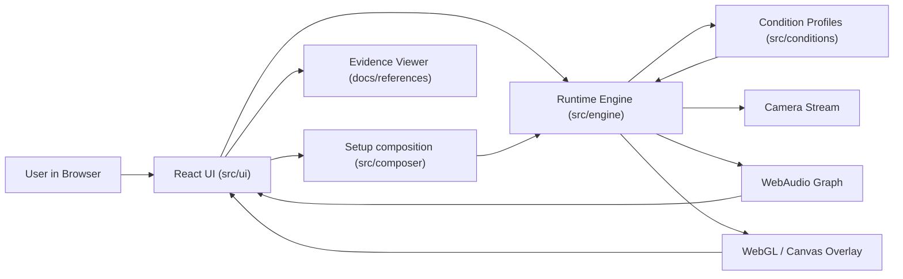

## Audio/Video Processing Flow

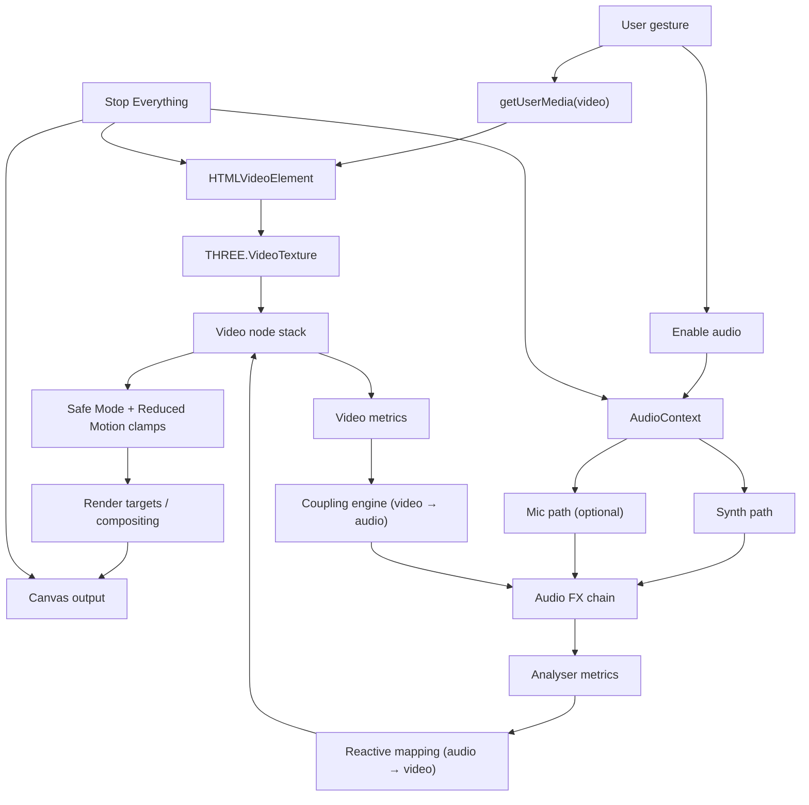

## Quality Gates

```bash
npm run browsers:install
npm run typecheck
npm run lint
npm test
npm run verify
npm run test:e2e
npm run test:e2e:preview
npm run check
```

Release-candidate helpers:

```bash
npm run screenshots:readme
npm run screenshots:verify
npm run release:rc:local
npm run release:rc:checklist
```

Browser-based checks use the Chrome, Firefox, and WebKit browsers installed by Playwright. Install them once per machine with
`npm run browsers:install`.

## Screenshot Tour

### Core Flow

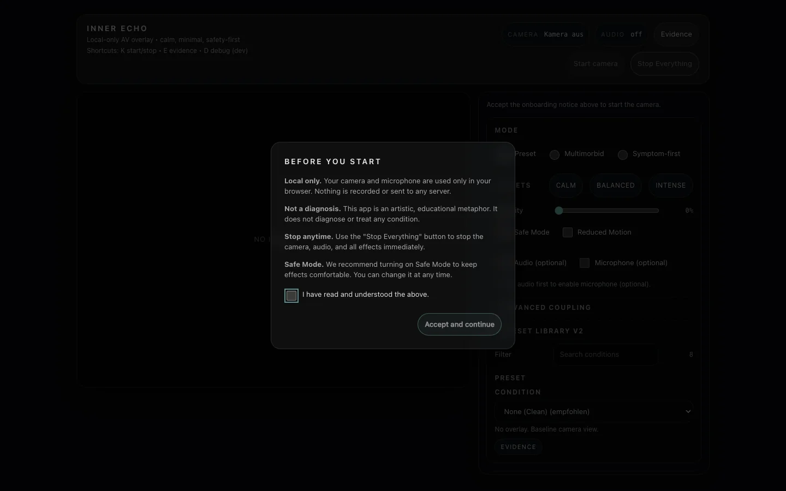
PNG fallback: [01-onboarding](assets/readme/screenshots/png/01-onboarding.png)

_Welcome disclosure before setup or any media activation._

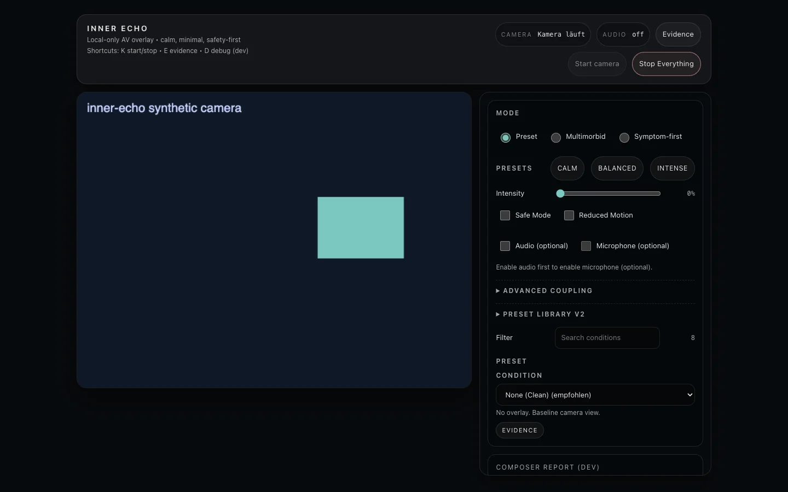
PNG fallback: [02-hero-active](assets/readme/screenshots/png/02-hero-active.png)

_Active runtime state with synthetic camera feed and truthful camera, sound, and effects status._

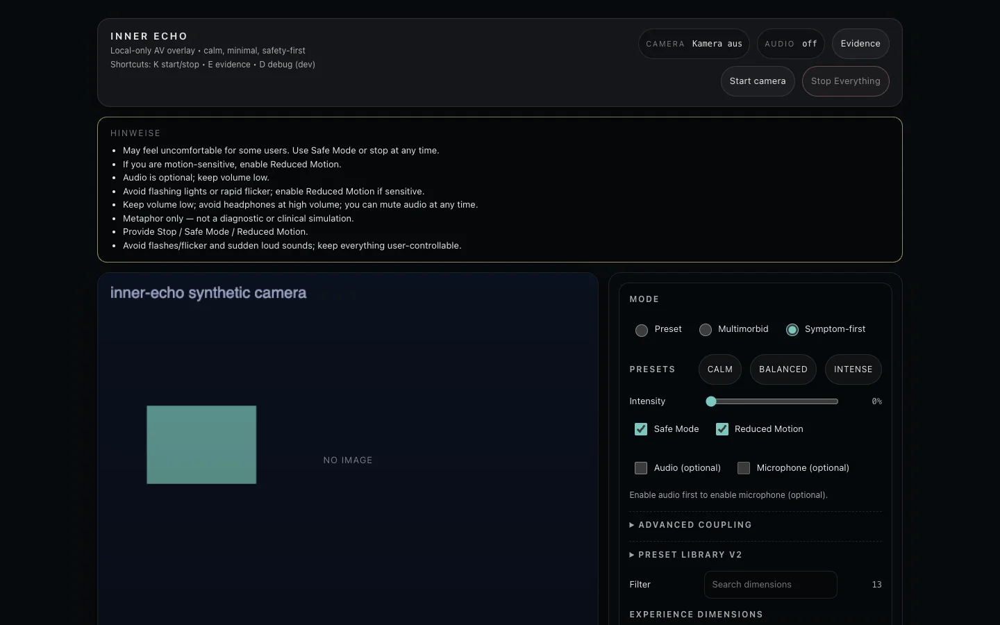
PNG fallback: [10-stop-everything-idle](assets/readme/screenshots/png/10-stop-everything-idle.png)

_Safety reset state after `Stop Everything`._

### Setup Modes

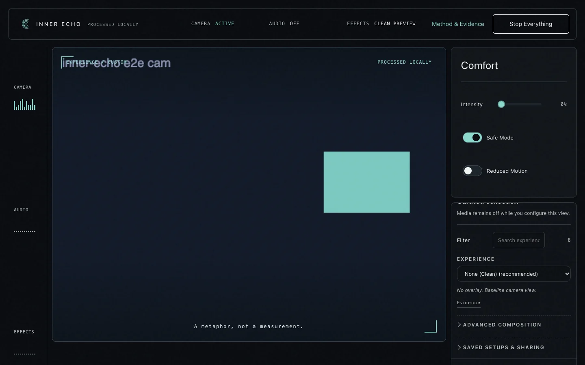
PNG fallback: [03-preset-mode](assets/readme/screenshots/png/03-preset-mode.png)

_A single curated collection used as contextual metaphor, not a diagnostic claim._

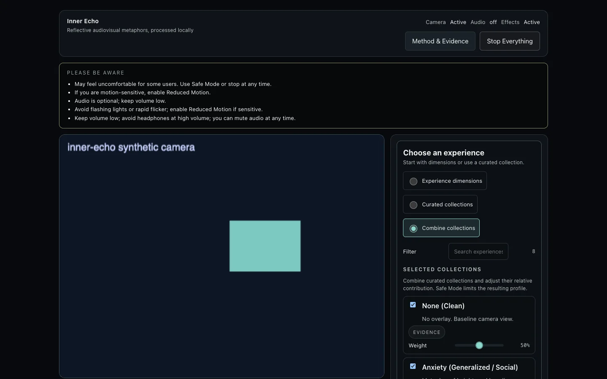
PNG fallback: [04-multimorbid-mode](assets/readme/screenshots/png/04-multimorbid-mode.png)

_Advanced combination of curated collections with relative weights._

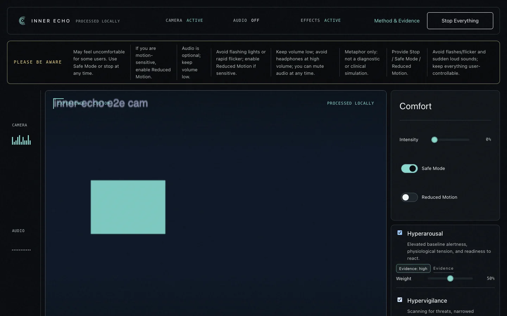
PNG fallback: [05-symptom-mode](assets/readme/screenshots/png/05-symptom-mode.png)

_The default dimensions-first setup with dimension-level control._

### Safety Controls

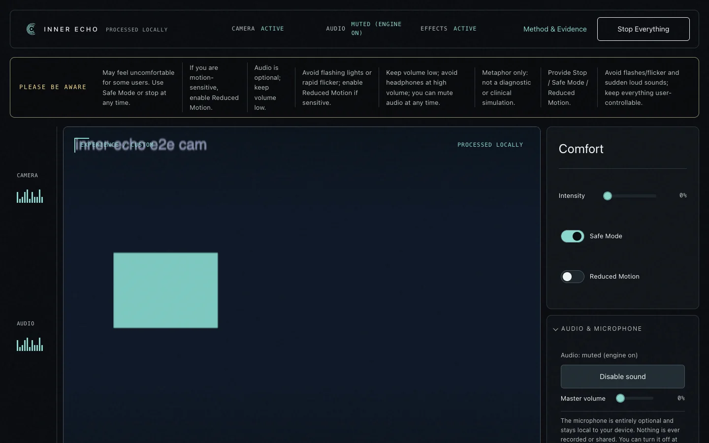
PNG fallback: [06-audio-mic-controls](assets/readme/screenshots/png/06-audio-mic-controls.png)

_Audio and optional microphone controls (local-only)._ 

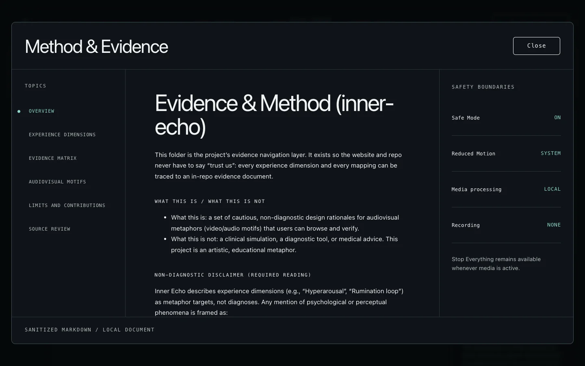
PNG fallback: [07-evidence-drawer](assets/readme/screenshots/png/07-evidence-drawer.png)

_Keyboard-accessible Method and Evidence dialog for traceability and review._

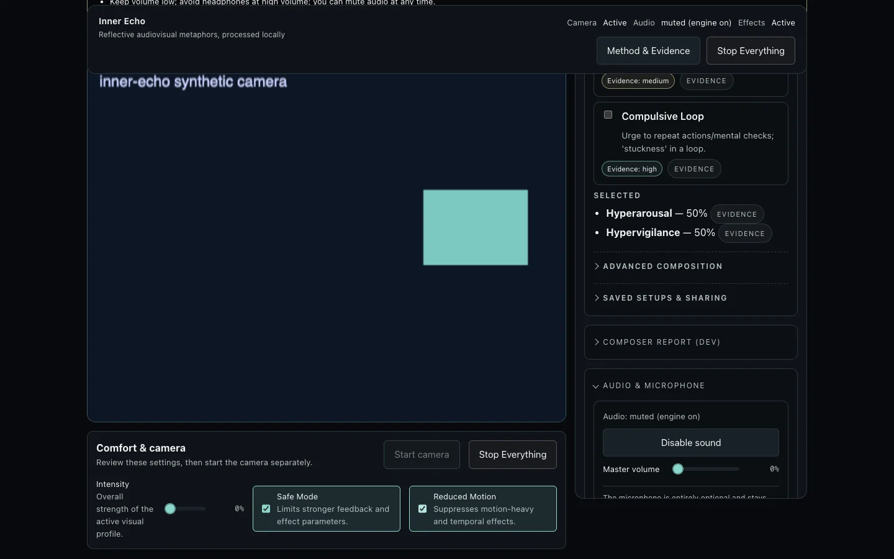
PNG fallback: [08-safety-toggles](assets/readme/screenshots/png/08-safety-toggles.png)

_Safe Mode and Reduced Motion guardrails remain directly accessible._

### Mobile Experience

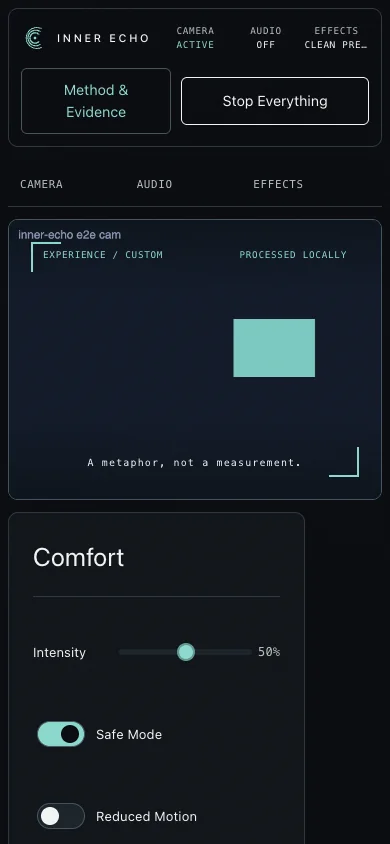
PNG fallback: [09-mobile-home-390x844](assets/readme/screenshots/png/09-mobile-home-390x844.png)

_Single-column mobile layout at `390x844` viewport._

## How Screenshots Are Produced

Screenshots are generated by a deterministic Playwright harness using synthetic camera input:

```bash
npm run screenshots:readme
npm run screenshots:verify
```

- No real camera feed is stored in the repository.
- Assets are generated from `assets/readme/screenshots/manifest.json`.
- Primary format is WebP with explicit PNG fallback links.

## Contributing

See [CONTRIBUTING.md](CONTRIBUTING.md) for setup instructions, contribution guidelines, and the safety checklist that applies to all PRs.

## Repository Boundary

Public source, maintained documentation, generated contract docs, and the canonical screenshot set live in tracked repository paths. Local analysis state, editor and agent metadata, generated reports, coverage, build output, private environment values, ad-hoc captures, and `docs/archive/` are ignored. `.env.example` documents safe local defaults; real `.env*` values must remain local.

## Evidence & Docs

- Evidence & method: [`docs/references/README.md`](docs/references/README.md)
- Architecture: [`docs/20_ARCHITECTURE.md`](docs/20_ARCHITECTURE.md)
- Conditions model: [`docs/40_CONDITIONS.md`](docs/40_CONDITIONS.md)
- Security checklist: [`docs/SECURITY.md`](docs/SECURITY.md)
- Reliability checklist: [`docs/RELIABILITY.md`](docs/RELIABILITY.md)

## RC Notes

Default release-candidate target for this cycle:
- Version: `0.1.0-rc.1`
- Tag convention: `v0.1.0-rc.N`

Recommended one-pass RC flow:

```bash
npm run release:rc:checklist
```

This executes local cleanup, clean install, Playwright browser install, dev and preview smoke gates, screenshot generation, and screenshot verification.
