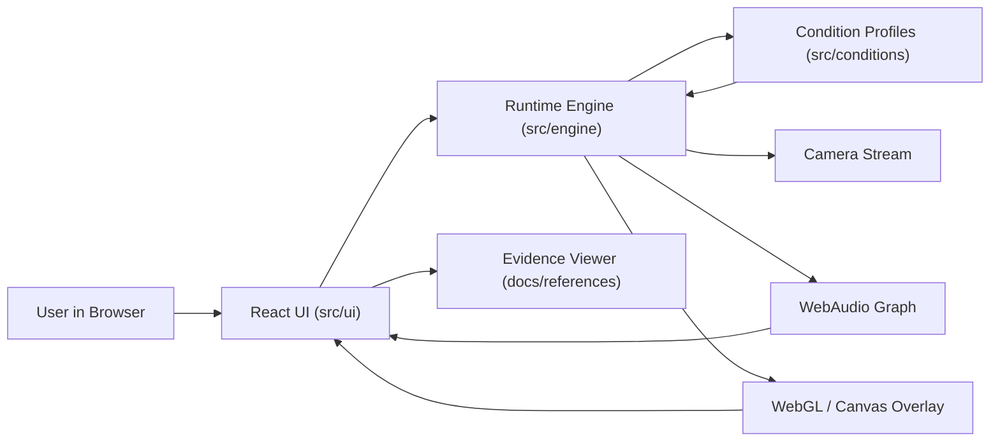
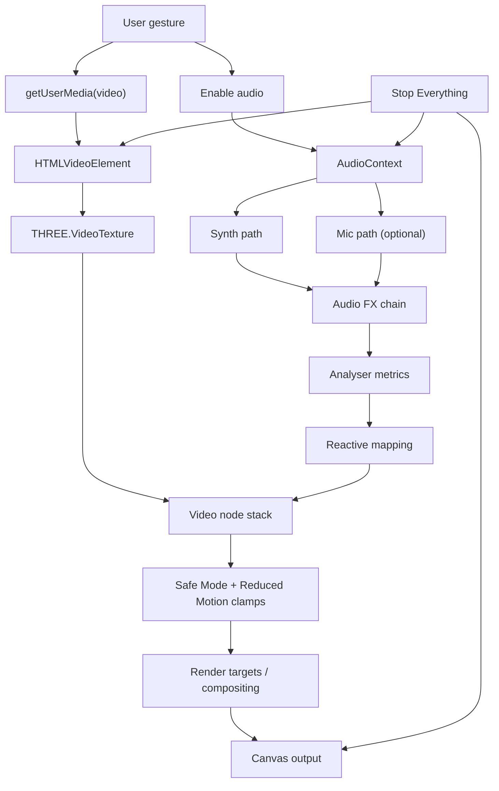

# inner-echo

Privacy-first, client-only webcam overlay app for metaphor-based experience framing.

## At a Glance (Public-Facing)

`inner-echo` is an interactive web app that helps make difficult internal experiences more discussable through careful audiovisual metaphors.

It is built to be:
- respectful and non-diagnostic,
- safety-oriented,
- transparent about evidence and limitations.

## Technical Scope (Engineer-Facing)

`inner-echo` is a browser-only runtime composed of:
- React UI (`src/ui`)
- local runtime engine (`src/engine`)
- profile-driven condition system (`src/conditions`)
- WebGL/Canvas video processing + optional WebAudio graph
- deterministic test and screenshot pipelines (Playwright + Vitest)

No backend is required for core runtime behavior.

## What This Repository Is

- A local-first prototype for exploring perceptual metaphors.
- A reproducible engineering artifact with quality gates and contract verification.
- A safety-first interface with explicit controls (`Safe Mode`, `Reduced Motion`, `Stop Everything`).
- A transparent documentation set with in-repo evidence references.

## What This Repository Is Not

`inner-echo` is not:
- a diagnostic tool,
- a medical device,
- a treatment platform,
- a claim of clinical simulation accuracy.

It does not attempt to infer mental health diagnoses from user data.
It does not send webcam or microphone streams to remote services in the current scope.

## Safety & Privacy

- Camera/microphone access is strictly user-gesture gated.
- Microphone is optional and can be disabled any time.
- Runtime is designed for offline-capable local execution.
- Debug/evidence tooling supports transparent review.

Canonical references:
- Reliability: [`docs/RELIABILITY.md`](docs/RELIABILITY.md)
- Security & privacy: [`docs/SECURITY.md`](docs/SECURITY.md)
- Evidence corpus: [`docs/references/README.md`](docs/references/README.md)

## Quick Start

```bash
npm install
npm run dev
```

Open `http://127.0.0.1:5173` (or the Vite host shown in your terminal).

## Architecture Flow



## Audio/Video Processing Flow



## Quality Gates

```bash
npm run lint
npm test
npm run verify
npm run test:e2e
npm run check
```

Release-candidate helpers:

```bash
npm run screenshots:readme
npm run screenshots:verify
npm run release:rc:local
npm run release:rc:checklist
```

## Screenshot Tour

### Core Flow


PNG fallback: [01-onboarding](assets/readme/screenshots/png/01-onboarding.png)

_Onboarding state before any camera activation._


PNG fallback: [02-hero-active](assets/readme/screenshots/png/02-hero-active.png)

_Active runtime state with synthetic camera feed and status pills._


PNG fallback: [10-stop-everything-idle](assets/readme/screenshots/png/10-stop-everything-idle.png)

_Safety reset state after `Stop Everything`._

### Composition Modes


PNG fallback: [03-preset-mode](assets/readme/screenshots/png/03-preset-mode.png)

_Preset mode for single-condition metaphor composition._


PNG fallback: [04-multimorbid-mode](assets/readme/screenshots/png/04-multimorbid-mode.png)

_Multimorbid mode with weighted preset stacking._


PNG fallback: [05-symptom-mode](assets/readme/screenshots/png/05-symptom-mode.png)

_Symptom-first mode with dimension-level control._

### Safety Controls


PNG fallback: [06-audio-mic-controls](assets/readme/screenshots/png/06-audio-mic-controls.png)

_Audio and optional microphone controls (local-only)._ 


PNG fallback: [07-evidence-drawer](assets/readme/screenshots/png/07-evidence-drawer.png)

_Evidence drawer for in-repo traceability and review._


PNG fallback: [08-safety-toggles](assets/readme/screenshots/png/08-safety-toggles.png)

_Safe Mode and Reduced Motion guardrails remain directly accessible._

### Mobile Experience


PNG fallback: [09-mobile-home-390x844](assets/readme/screenshots/png/09-mobile-home-390x844.png)

_Single-column mobile layout at `390x844` viewport._

## How Screenshots Are Produced

Screenshots are generated by a deterministic Playwright harness using synthetic camera input:

```bash
npm run screenshots:readme
npm run screenshots:verify
```

- No real camera feed is stored in the repository.
- Assets are generated from `assets/readme/screenshots/manifest.json`.
- Primary format is WebP with explicit PNG fallback links.

## Contributing

See [CONTRIBUTING.md](CONTRIBUTING.md) for setup instructions, contribution guidelines, and the safety checklist that applies to all PRs.

## Evidence & Docs

- Evidence & method: [`docs/references/README.md`](docs/references/README.md)
- Architecture: [`docs/20_ARCHITECTURE.md`](docs/20_ARCHITECTURE.md)
- Conditions model: [`docs/40_CONDITIONS.md`](docs/40_CONDITIONS.md)
- Security checklist: [`docs/SECURITY.md`](docs/SECURITY.md)
- Reliability checklist: [`docs/RELIABILITY.md`](docs/RELIABILITY.md)

## RC Notes

Default release-candidate target for this cycle:
- Version: `0.1.0-rc.1`
- Tag convention: `v0.1.0-rc.N`

Recommended one-pass RC flow:

```bash
npm run release:rc:checklist
```

This executes local cleanup, clean install, quality gates, screenshot generation, and screenshot verification.
