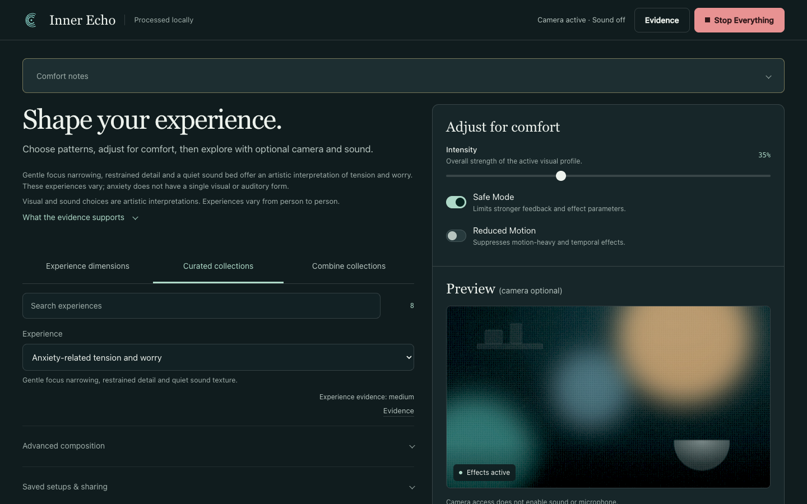
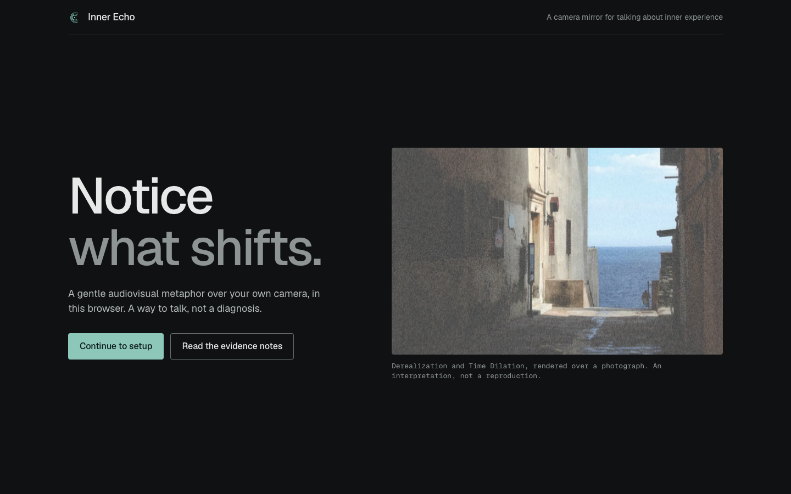
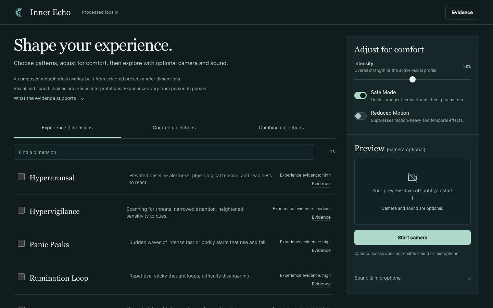
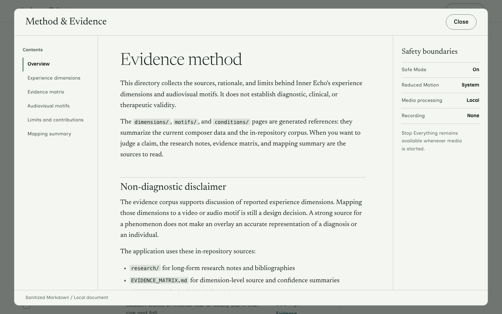
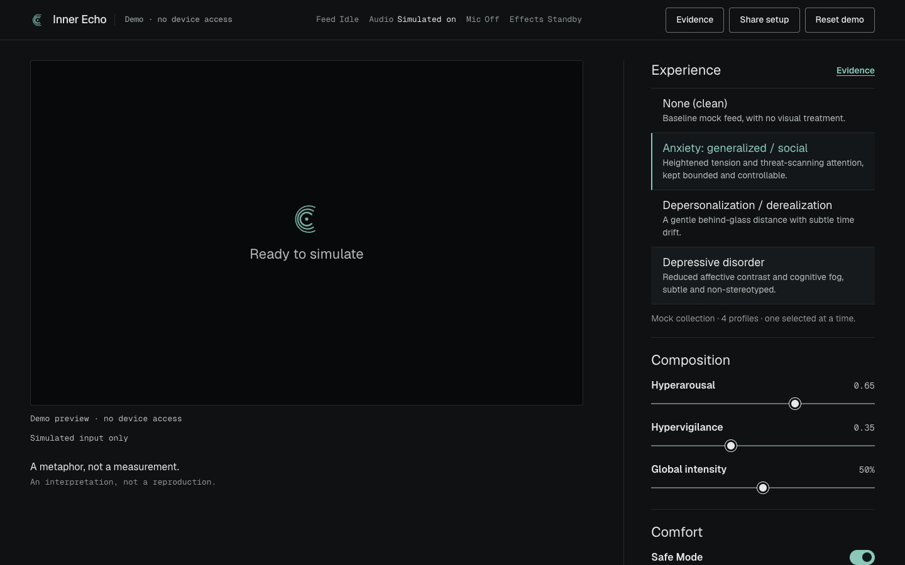
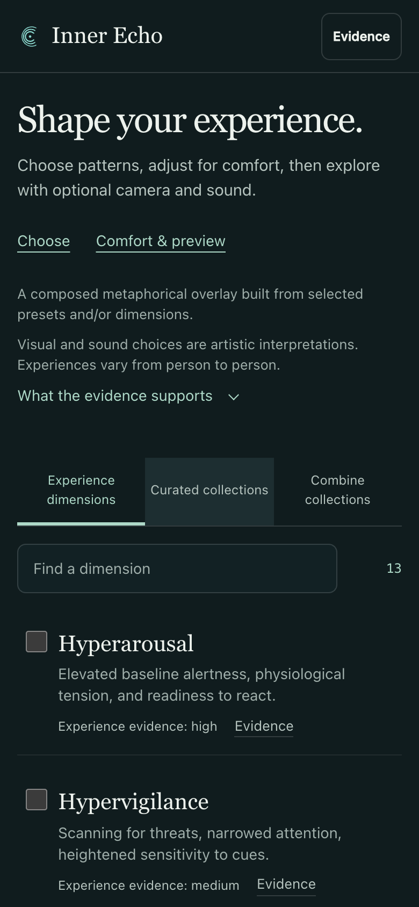

# Inner Echo

[](https://github.com/sebastianspicker/inner-echo/actions/workflows/ci.yml)
[](LICENSE)

A browser camera toy for talking about inner experience. Pick an experience pattern and Inner Echo
lays a gentle audiovisual metaphor over your own camera feed — focus tightening, colour draining,
a steady pulse — so an invisible state has something to point at.

It is a conversation starter, not a diagnosis, a measurement, or a simulation of a condition.
Everything runs locally: no server, no account, no upload, no recording.

[Live app](https://sebastianspicker.github.io/inner-echo/) ·
[Device-free demo](https://sebastianspicker.github.io/inner-echo/demo/) ·
[Product scope](PRODUCT.md)



## Screenshot tour

| | |
| --- | --- |
|  |  |
| **Welcome.** What the tool is, what it is not, and what happens to your media. Nothing is requested yet. | **Setup.** Choose experience dimensions or a curated collection, then tune intensity and comfort. |
|  |  |
| **Live session.** Effects run over your camera feed, captioned with what they show and what they are not. Safe Mode, Reduced Motion, and Stop Everything stay within reach. | **Evidence drawer.** The sources, confidence labels, and stated limits behind each experience and motif. |
|  |  |
| **Device-free demo.** The full interface with deterministic mock data — no camera, microphone, audio, storage, or network. | **Mobile.** One scrolling column with the same controls as the desktop layout. |

## Try it

- **Live app:** [sebastianspicker.github.io/inner-echo](https://sebastianspicker.github.io/inner-echo/)
  — needs a camera for the live experience.
- **Device-free demo:** [sebastianspicker.github.io/inner-echo/demo](https://sebastianspicker.github.io/inner-echo/demo/)
  — the same interface with mock data, safe on any machine.

Or run it locally:

```bash
git clone https://github.com/sebastianspicker/inner-echo.git
cd inner-echo
npm ci --ignore-scripts
npm rebuild esbuild
npm run dev
```

Open the printed loopback URL (usually `http://localhost:5173`). The demo is at `/demo/`.

Requires Node.js 22 and npm 11. Only the live experience needs a camera; everything else works
without one.

## What it does

- Compose an experience from dimensions, a curated collection, or a weighted blend.
- Render it as WebGL effects over the camera, with Canvas2D and raw-preview fallbacks.
- Keep comfort in your hands: Safe Mode, Reduced Motion, global intensity, and Stop Everything.
- Add optional synthesized sound and optional microphone input, each switched on separately.
- Save setups locally and share non-media setup via a `#preset=` link.
- Read the bundled evidence that explains each mapping and where it runs out.
- Try the same interface as a device-free demo at `/demo/`.

## What it deliberately does not do

- No backend, accounts, analytics, recording, export, upload, or offline cache.
- No diagnosis, scoring, assessment, or claim to tell you what you are experiencing.
- Camera, microphone, and audio never start on their own — not at startup, not from a saved preset,
  and not from a shared link.

## How it works

Inner Echo is a single static React app with two entries: the live experience (`index.html`) and a
device-free mock (`demo/index.html`). Dependencies point inward:

```
shared  <-  domain/experience  <-  content + runtime  <-  app/experience
demo    ->  demo + shared only
```

`src/domain/experience/` holds pure schemas, safety policy, parameter addressing, and composition;
it never touches the browser. `src/content/` turns bundled JSON and Markdown into validated values.
`src/runtime/` owns the camera, Web Audio, rendering, and coupling, all driven by one media session
(`src/runtime/session/`) that the app subscribes to. `src/app/` composes the workflow. The demo
stays isolated from all of it.

See [docs/ARCHITECTURE.md](docs/ARCHITECTURE.md) for the full picture.

## Local state

There is no runtime configuration. With `VITE_INNER_ECHO_DEBUG_UI=true npm run dev`, a development
build also exposes diagnostic controls; the flag is gated by `import.meta.env.DEV`, so it does
nothing in production.

| Where | Key | What it holds |
| --- | --- | --- |
| `localStorage` | `inner-echo-welcome-acknowledged-v2` | Whether you have seen the welcome. |
| `localStorage` | `ie_custom_presets_v2` | Up to 30 validated setup snapshots. |
| URL hash | `#preset=` | A shared setup, capped at 8,192 characters. |

The loader can also migrate the older `ie_custom_preset` key. Loading, migrating, or importing a
setup never starts media or sound.

## Commands

Run everything from the repository root.

| Command | What it does |
| --- | --- |
| `npm run dev` | Start the Vite dev server. |
| `npm run build` | Type-check and build both static entries into `dist/`. |
| `npm run verify` | Run the complete repository gate. |
| `npm run typecheck` | Check the browser, domain, build-config, and tools TypeScript projects. |
| `npm run lint` | Run Biome; warnings fail. |
| `npm run quality:check` | Lint plus file-size, function-length, complexity, and duplication limits. |
| `npm run architecture:check` | Reject forbidden imports and import cycles. |
| `npm run pages:build` | Assemble the GitHub Pages artifact. |
| `npm run pages:verify` | Verify Pages paths, entries, CSP fallback, demo isolation, and artifact hygiene. |

The full command matrix, generated-file workflow, and release procedure live in
[CONTRIBUTING.md](CONTRIBUTING.md) and [docs/RELEASING.md](docs/RELEASING.md).

## Project layout

| Path | What lives there |
| --- | --- |
| `src/app/` | React composition, visible settings, presets, and user workflows, organized by feature. |
| `src/domain/experience/` | Browser-independent schemas, safety policy, and composition. |
| `src/content/` | Bundled profile, mapping, and evidence adapters. |
| `src/runtime/` | Camera, Web Audio, visual rendering, reactive coupling, and the media session that owns them. |
| `src/demo/`, `demo/` | The device-free mock: a dependency-free controller and semantic HTML. |
| `tools/` | Build-time validators, doc generators, release checks, and Pages assembly. |
| `docs/references/` | Evidence corpus and the generated evidence pages the app bundles. |
| `docs/generated/` | Derived catalog and schema references. |

`dist/`, reports, coverage, dependencies, caches, analysis indexes, and editor state are generated
or local-only and should not be committed.

## Documentation

- [Product scope and design principles](PRODUCT.md)
- [Architecture](docs/ARCHITECTURE.md)
- [Safety and ethics](docs/SAFETY.md)
- [Profile and mapping authoring](docs/PROFILE_AUTHORING.md)
- [Reliability and manual verification](docs/RELIABILITY.md)
- [Alpha release procedure](docs/RELEASING.md)
- [Evidence method and corpus](docs/references/README.md)
- [Contributing](CONTRIBUTING.md)
- [Security policy](SECURITY.md)

## License

Inner Echo is released under the [MIT License](LICENSE). Runtime dependency notices are in
[public/THIRD_PARTY_NOTICES.txt](public/THIRD_PARTY_NOTICES.txt).
