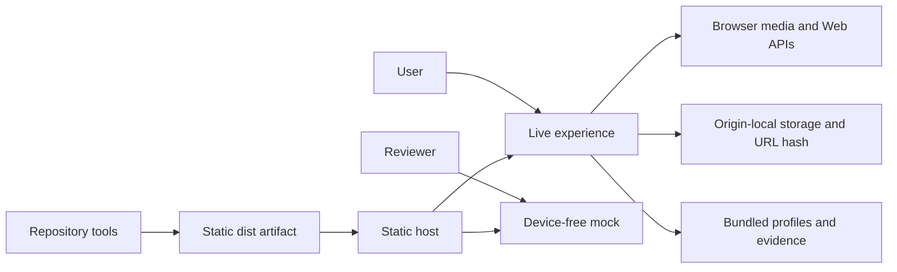
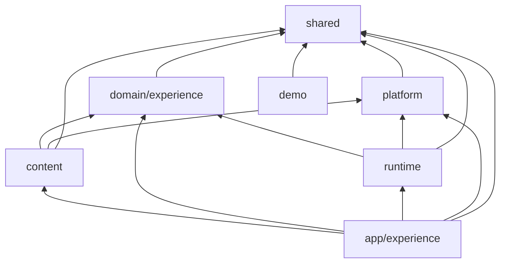
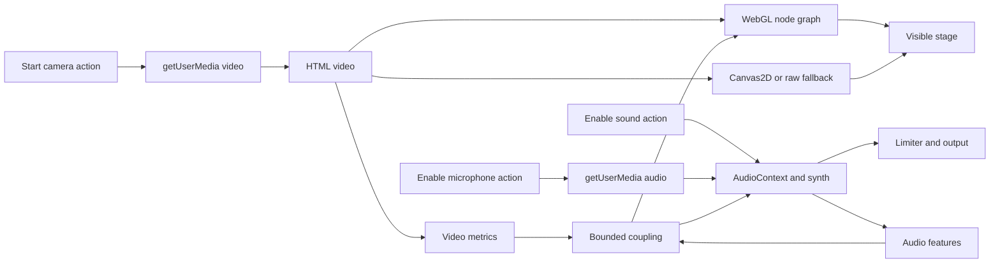

# Architecture

Inner Echo is one private npm package that builds two static browser entries: the live experience
and a device-free mock. There is no backend, service process, database, account system, or remote
application API.

## System context

The static host serves the app. Camera, microphone, and audio all stay inside the browser. The only
user-facing path off the origin is following an external citation in the evidence drawer; the app
never fetches citations in the background.

## Entries and components

| Path | Responsibility |
| --- | --- |
| `index.html` → `src/main.tsx` | Live application bootstrap and error boundary. |
| `src/app/experience/` | React composition root, visible state, user actions, preset workflows, and lifecycle orchestration. |
| `src/domain/experience/` | Pure schemas, safety and motion policy, parameter addressing, stack resolution, and composition. |
| `src/content/experience/` | Bundled catalog, profiles, dimensions, mappings, and validating adapters. |
| `src/content/evidence/` | Bundled Markdown lookup, parsing, and sanitization. |
| `src/runtime/camera/` | Video-only camera acquisition and track cleanup. |
| `src/runtime/audio/` | `AudioContext`, synth, optional microphone, effects, analysis, and disposal. |
| `src/runtime/visual/` | Video-node factories, WebGL rendering, Canvas2D fallback, metrics, and GPU cleanup. |
| `src/runtime/coupling/` | Bounded audio-to-video and video-to-audio mappings. |
| `src/platform/`, `src/shared/` | Focused diagnostics and cross-layer primitives. |
| `demo/index.html` → `src/demo/main.ts` | Semantic mock product states plus a dependency-free DOM controller, with no live device, persistence, clipboard, or network capability. |
| `tools/` | Build-time validation, documentation generation, release inspection, and Pages assembly. |

The mock entry imports no React and no production layer. `src/demo/` may import only itself and
`src/shared/`, and its current controller has no dependencies at all. Pages verification walks the
demo's static and dynamic imports and scans every JavaScript chunk in that closure for media, audio,
media-playback, persistent-storage, clipboard, and network APIs.

## Dependency direction

`domain` is browser-independent: it receives immutable capability identifiers, never constructors or
browser handles. `content` turns bundled data into validated domain values. `runtime` owns effects
and side effects. `app` combines the inward layers and owns user-facing workflow state.

`npm run architecture:check` enforces these import directions and rejects static or dynamic import
cycles. `tsconfig.domain.json` omits DOM libraries so domain and shared code cannot pick up browser
globals by accident.

## Experience data flow

1. Content adapters load bundled catalog, dimension, mapping, or profile JSON.
2. Zod schemas reject invalid data and normalize supported optional values.
3. `useProfileLoad` selects a curated profile or composes one from dimensions or weighted collections.
4. Domain policy applies interaction, global bounds, Safe Mode, and Reduced Motion.
5. After camera metadata is available, the app lazily loads graph, coupling, and overlay constructors.
6. `runtime/visual/graph` creates executable video nodes from declarative `video_stack` entries.
7. The audio engine applies the desired audio stack when sound has been activated.

Persisted setup-mode values remain `symptom`, `preset`, and `multimorbid` for compatibility, while
the interface labels them Experience dimensions, Curated collections, and Combine collections.

## Media and coupling flow

Camera, sound, and microphone activate separately. A microphone request is only possible once the
audio graph exists. Importing a preset updates the desired configuration with audio forced off.

The WebGL frame loop reads current control refs and samples metrics only when something live needs
them. Video readback runs for active coupling or development diagnostics; audio features run for
coupling or applicable legacy RMS mappings. The development RMS meter has its own activation gate.
Changing those controls takes effect without restarting the overlay. Withdrawing audio overrides or
stopping the overlay restores each affected audio module's original parameters, including defaults
omitted from legacy presets. Schema ranges, profile policy, user controls, Safe Mode, Reduced
Motion, and engine clamps all constrain coupling.

The audio session compares canonical stack values before scheduling a switch, so an equivalent
profile update preserves oscillators, buffers, and the existing effects chain. One retained output
guard follows the master gain and all mixed sources, independently of the optional profile chain.
Its non-oversampled WaveShaper curve keeps quiet samples linear and smoothly bounds per-channel
digital samples below the global -6 dBFS ceiling. Profile compressor ceilings are attenuation
settings, not additional hard output limits. This digital bound does not guarantee reconstructed
true peak or acoustic volume at the listener's device.

## State and lifecycle ownership

React owns visible state and consent actions. The public state contracts are:

- camera: `idle`, `requesting`, `active`, `denied`, or `error`;
- sound: `off`, `starting`, `on`, or `error`;
- microphone: `off`, `requesting`, `on`, `denied`, or `error`;
- overlay: renderer `webgl`, `2d`, `raw`, or `unavailable`, plus `effectsActive` and an optional error;
- profile and catalog loading: explicit loading, ready, and error states.

Interruptions and browser blocks surface through the applicable error state and message, not as
separate public union members. Visible state follows real runtime transitions; clicking a control
never optimistically claims capability.

Long-lived browser resources live inside runtime controls and focused session hooks, and
request-sequence guards discard stale async results. Stop Everything invalidates pending camera and
audio work, then stops the overlay, audio graph, microphone tracks, camera tracks, video bindings,
and canvases before returning the UI to idle. A camera interruption tears down the camera and
overlay but does not silently stop independently activated audio.

## Rendering and bundle boundaries

WebGL is preferred only after renderer startup succeeds. A startup or fatal runtime failure falls
back to Canvas2D passthrough; if no safe canvas remains, the app reports the raw video or an
unavailable state. Fallbacks never claim active WebGL effects.

The welcome entry mounts the workspace only after acknowledgement, and evidence stays available
through the sanitized lazy drawer before Continue. The direct sound action creates or resumes the
audio context before asynchronously loading engine construction, and sequence guards prevent stopped
or superseded requests from installing an engine. The graph and Three.js constructors load after the
camera becomes usable. `npm run bundle:verify` enforces these loading boundaries and keeps
development-only diagnostics out of production chunks.

When a profile changes, the overlay lifecycle compares a canonical identity of video definitions,
audio-chain definitions, reactive mappings, safety policy, and Reduced Motion. Equivalent profiles
keep the graph and coupling state while live control refs and parameter synchronization apply the
current values. Camera restart and explicit profile retry remain restart triggers. Renderer sizing
tracks container size and capped DPR independently from internal render-target scale.

Vite emits `index.html` and `demo/index.html` without source maps and includes the public notice
files. The Pages assembler applies the configured base path, adds `.nojekyll`, and injects the
document-level CSP fallback before load-bearing elements in every HTML entry. See
[RELEASING.md](RELEASING.md) and [../SECURITY.md](../SECURITY.md).

## Extension points and invariants

- Add pure experience policy to `domain`, bundled definitions to `content`, device or constructor
  behavior to `runtime`, and workflow composition to `app`.
- Keep runtime subsystem imports behind narrow `index.ts` or graph facades.
- Treat schemas, profiles, mappings, graph builders, registries, safety policy, and generated
  references as one contract.
- Keep registry metadata introspection-only; runtime builders remain the executable authority.
- Never add passive media activation, unbounded coupling, unsanitized evidence HTML, production
  stress controls, or device capability to the mock entry.

Accepted rationale and rollback triggers are recorded in [decisions/](decisions/README.md).
