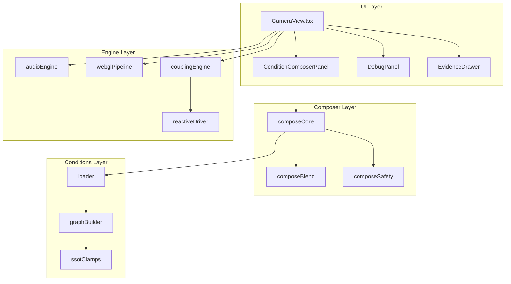

# Inner Echo - Comprehensive Improvement Plan

## Overview

This plan covers repository cleanup, code improvements, deduplication, refactoring, and potential enhancements for the Inner Echo project.

**Status: Phase 1 COMPLETED** ✅

---

## 1. Repository Cleanup ✅ COMPLETED

### 1.1 Documentation Audit

Based on [`docs/00_DOC_INVENTORY.md`](docs/00_DOC_INVENTORY.md), the following files were removed:

| File | Status | Action Taken |
|------|--------|--------------|
| `docs/ARCHITECTURE.md` | Duplicate | ✅ Removed - content in [`docs/20_ARCHITECTURE.md`](docs/20_ARCHITECTURE.md) |
| `docs/PRD.md` | Merged | ✅ Removed - content in [`docs/10_PRODUCT.md`](docs/10_PRODUCT.md) |
| `docs/MVP.md` | Merged | ✅ Removed - content in [`docs/10_PRODUCT.md`](docs/10_PRODUCT.md) |
| `docs/DESIGN.md` | Merged | ✅ Removed - content in [`docs/30_SAFETY_ETHICS.md`](docs/30_SAFETY_ETHICS.md) |
| `docs/USER_STORIES.md` | Merged | ✅ Removed - content in [`docs/10_PRODUCT.md`](docs/10_PRODUCT.md) |
| `docs/FRONTEND.md` | Merged | ✅ Removed - content in [`docs/20_ARCHITECTURE.md`](docs/20_ARCHITECTURE.md) |
| [`docs/REVIEW.md`](docs/REVIEW.md) | Reference | Kept as historical record |

### 1.2 Scripts Cleanup ✅ COMPLETED

| Script | Action Taken |
|--------|--------------|
| `scripts/remove-cursor-coauthor.sh` | ✅ Removed - one-time cleanup script no longer needed |

### 1.3 Dependencies Fixed ✅ COMPLETED

- Added `@types/node` to devDependencies to fix TypeScript compilation errors

---

## 2. Code Deduplication ✅ COMPLETED

### 2.1 Duplicate Type Definitions ✅ COMPLETED

Found **3 duplicate type definitions** that were consolidated:

#### `MotifDef` - Was defined in 3 files:
- ✅ Consolidated into [`src/composer/types.ts`](src/composer/types.ts)
- All files now import from the shared location

#### `ExperienceDimensionDef` - Was defined in 2 files:
- ✅ Consolidated into [`src/composer/types.ts`](src/composer/types.ts)

#### `DimensionSignalMappingEntry` - Was defined in 2 files:
- ✅ Consolidated into [`src/composer/types.ts`](src/composer/types.ts)

### 2.2 Duplicate Functions ✅ COMPLETED

#### `smoothStep()` - Was defined in 4 files:
- ✅ Moved to [`src/utils/numeric.ts`](src/utils/numeric.ts)
- Updated imports in:
  - [`src/engine/audio/audioEngine.ts`](src/engine/audio/audioEngine.ts)
  - [`src/engine/reactive/couplingEngine.ts`](src/engine/reactive/couplingEngine.ts)
  - [`src/engine/reactive/reactiveDriver.ts`](src/engine/reactive/reactiveDriver.ts)
  - [`src/engine/canvas/videoMetrics.ts`](src/engine/canvas/videoMetrics.ts)

---

## 3. Code Refactoring

### 3.1 CameraView.tsx Decomposition

[`src/ui/CameraView.tsx`](src/ui/CameraView.tsx) is **37,730 characters** - a "god component" that handles:

1. Camera lifecycle
2. Audio lifecycle
3. Overlay loop wiring
4. Composition state
5. Evidence drawer routing
6. Debug rendering

**Recommended extraction into custom hooks:**

```
src/ui/hooks/
├── useCameraController.ts    # Camera stream management
├── useAudioController.ts     # Audio engine + mic management
├── useOverlayController.ts   # WebGL overlay loop
├── useComposerState.ts       # Composition mode + settings
└── useSafetyState.ts         # Safe mode + reduced motion
```

**Benefits:**
- Improved testability
- Clearer separation of concerns
- Easier debugging
- Better code navigation

### 3.2 Engine Module Organization

Current structure is good, but consider:

```
src/engine/
├── audio/
│   ├── core/              # contextManager, audioEngine
│   ├── fx/                # effects (already good)
│   └── types.ts           # (already exists)
├── video/
│   └── camera.ts          # (already good)
├── canvas/
│   ├── webgl/             # Split webglPipeline.ts
│   │   ├── pipeline.ts
│   │   ├── resources.ts
│   │   └── materials.ts
│   └── index.ts
└── reactive/
    ├── couplingEngine.ts
    └── reactiveDriver.ts
```

### 3.3 WebGL Pipeline Refactoring

[`src/engine/canvas/webglPipeline.ts`](src/engine/canvas/webglPipeline.ts) is **22,770 characters**. Consider splitting:

- `pipelineCore.ts` - Main loop, FPS guard
- `pipelineResources.ts` - Render target management
- `pipelineMaterials.ts` - Material creation
- `pipelineDiagnostics.ts` - Diagnostics interface

---

## 4. Code Improvements

### 4.1 Performance Optimizations

From [`docs/REVIEW.md`](docs/REVIEW.md):

| Issue | Severity | Status | Action |
|-------|----------|--------|--------|
| Per-frame allocations in audio analysis | High | Partially fixed | Verify scratch buffer reuse |
| Per-frame object allocations in reactive/coupling | Medium | Partially fixed | Verify output object reuse |
| Bundle size warning | Low | Open | Implement code splitting |

**Recommended actions:**

1. **Verify scratch buffer reuse** in [`src/engine/audio/audioEngine.ts`](src/engine/audio/audioEngine.ts):
   - `computeRms()` - line 45
   - `computeSpectralFeatures()` - line 71

2. **Implement code splitting** in [`vite.config.ts`](vite.config.ts):
   ```typescript
   build: {
     rollupOptions: {
       output: {
         manualChunks: {
           'three': ['three'],
           'react-vendor': ['react', 'react-dom'],
           'evidence': ['./src/evidence'],
         }
       }
     }
   }
   ```

### 4.2 Error Handling Improvements

1. **Add error boundaries** for each major subsystem:
   - `CameraErrorBoundary`
   - `AudioErrorBoundary`
   - `WebGLErrorBoundary`

2. **Improve error messages** in [`src/ui/cameraMessages.ts`](src/ui/cameraMessages.ts):
   - Add recovery suggestions
   - Link to help documentation

### 4.3 Logging Standardization

Use [`src/utils/logger.ts`](src/utils/logger.ts) consistently:

```typescript
// Current: Mixed usage
console.warn('Unknown node type:', type)

// Preferred: Use logger
import { logger } from '../utils/logger'
logger.warn('Unknown node type:', type)
```

---

## 5. Quality of Life Improvements

### 5.1 Developer Experience

| Improvement | Description |
|-------------|-------------|
| Add ESLint | Configure ESLint with React/TypeScript rules |
| Add Prettier | Format on save configuration |
| Add Husky | Pre-commit hooks for lint/test |
| Add VSCode settings | Recommended extensions, debug configs |

### 5.2 Testing Improvements

Current test coverage is minimal. Add tests for:

1. **Safety clamps** - [`src/conditions/ssotClamps.ts`](src/conditions/ssotClamps.ts)
2. **Composition logic** - [`src/composer/composeCore.ts`](src/composer/composeCore.ts)
3. **Parameter merging** - [`src/composer/composeBlend.ts`](src/composer/composeBlend.ts)
4. **Coupling engine** - [`src/engine/reactive/couplingEngine.ts`](src/engine/reactive/couplingEngine.ts)

### 5.3 Documentation Improvements

1. **Add JSDoc comments** to all exported functions
2. **Add architecture diagrams** using Mermaid
3. **Create API reference** for composer types

---

## 6. Potential New Features

### 6.1 User Features

| Feature | Description | Priority |
|---------|-------------|----------|
| Preset saving | Save custom compositions to localStorage | High |
| Export/Import | Share presets via JSON export | Medium |
| Keyboard shortcuts | Quick access to common actions | Medium |
| Fullscreen mode | Immersive experience | Low |
| Screenshot capture | Save current frame | Low |

### 6.2 Condition Features

| Feature | Description | Priority |
|---------|-------------|----------|
| Custom dimension weights | Fine-tune individual dimensions | High |
| Condition favorites | Quick access to preferred conditions | Medium |
| Condition search | Filter conditions by name/symptom | Medium |

### 6.3 Audio Features

| Feature | Description | Priority |
|---------|-------------|----------|
| Audio presets | Pre-configured audio stacks | Medium |
| Volume normalization | Consistent output levels | Low |
| Audio visualization | Waveform/spectrum display | Low |

---

## 7. UI Improvements

### 7.1 Visual Design

| Improvement | Description |
|-------------|-------------|
| Dark mode | System-aware theme switching |
| Responsive layout | Better mobile support |
| Accessibility | ARIA labels, keyboard navigation |
| Loading states | Skeleton screens, progress indicators |

### 7.2 UX Improvements

| Improvement | Description |
|-------------|-------------|
| Onboarding flow | Guided tour for new users |
| Tooltips | Contextual help for controls |
| Undo/Redo | Revert recent changes |
| Confirmation dialogs | Prevent accidental data loss |

### 7.3 Component Improvements

1. **Condition Composer Panel** ([`src/ui/ConditionComposerPanel.tsx`](src/ui/ConditionComposerPanel.tsx)):
   - Add visual feedback for weight changes
   - Improve dimension selection UX
   - Add preset preview

2. **Debug Panel** ([`src/ui/DebugPanel.tsx`](src/ui/DebugPanel.tsx)):
   - Add collapsible sections
   - Add export to JSON
   - Add real-time graphs

---

## 8. Implementation Priority

### Phase 1: Cleanup & Deduplication (Low Risk)
1. Remove duplicate documentation files
2. Consolidate duplicate type definitions
3. Move `smoothStep` to shared utility
4. Remove unused scripts

### Phase 2: Refactoring (Medium Risk)
1. Extract custom hooks from CameraView
2. Split WebGL pipeline
3. Standardize logging

### Phase 3: Improvements (Medium Risk)
1. Add ESLint/Prettier
2. Expand test coverage
3. Performance optimizations

### Phase 4: New Features (Higher Risk)
1. Preset saving
2. Dark mode
3. Keyboard shortcuts

---

## 9. Architecture Diagram



---

## 10. Files to Modify

### Immediate Actions
- [`src/composer/types.ts`](src/composer/types.ts) - Add consolidated types
- [`src/utils/numeric.ts`](src/utils/numeric.ts) - Add `smoothStep` function
- [`vite.config.ts`](vite.config.ts) - Add code splitting config

### Refactoring Actions
- [`src/ui/CameraView.tsx`](src/ui/CameraView.tsx) - Extract hooks
- [`src/engine/canvas/webglPipeline.ts`](src/engine/canvas/webglPipeline.ts) - Split into modules

### Cleanup Actions
- Remove duplicate docs
- Remove unused scripts
- Update imports after consolidation

---

## Next Steps

1. Review this plan and prioritize items
2. Create GitHub issues for approved items
3. Implement in phases as outlined above
4. Update documentation as changes are made
